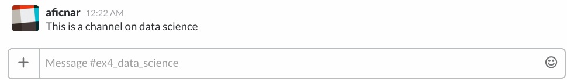

# Slack Police: You have the right to stay on topic

This is a project I did as a Data Science Fellow at [Insight Data Science](http://insightdatascience.com/) in the January 2017 session, in consultation with [Fast Forward Labs](http://www.fastforwardlabs.com/). 

Fast Forward Labs is in business of building prototypes by taking cutting edge machine learning and AI research and evaluating its feasibility in the real world. They were interested in building a chat bot that incorporates some pretty cool recent methods for natural language processing.

And so I built a user-friendly and reasonably smart bot for Slack that helps users stay on topic. 

[Here](https://docs.google.com/presentation/d/1VLeTp8POxU1A3GbDOCrLtfiA20Cu3ofJFv76Ezbo4Vk/pub?start=false&loop=false&delayms=3000) is the presentation that closely follows this blog.

---

# Contents

[**1. Why a smart policing bot?**](#why_bot)

[**2. Getting the data**](#get_data)

[**3. Demo: Officer Slack in action**](#demo)

[**4. Bot brains**](#bot_brains)

[**5. How smart is the bot?**](#bot_smart)

[**6. Summary & what more can be done**](#summary)

[**7. About me**](#about_me)

---

# <a name="why_bot">1. Why a smart policing bot?</a>

[Slack](https://slack.com/) is a popular messaging app for teams that allows team members to discuss different topics, organized in channels. Now, when a new member joins a Slack team that's been around for some time, they sometimes tend to post messages in wrong channels. Nobody wants to be that nagging senior team member trying to direct this rookie to a more appropriate place. 

Wouldn't it be nice to have a smart bot that can learn topics of different channels, monitor the discussions and then warn the users when they go off topic? Building such a bot is the aim of this project.

---

# <a name="get_data">2. Getting the data</a>

In order to build my bot and see how accurately it's performing, I needed some data. Slack data is hard to come by, since it's private. The next best thing is [Reddit](https://www.reddit.com/), since its data is easily available and has a similar structure to Slack, where instead of channels, different topics are grouped into subreddits. 

For the purposes of demonstrating the model, I chose the following five topics (subreddits): *Diving*, *Handball*, *Corgi*, *Data Science*, and *Machine Learning*. These have been chosen intentionally so that some of them are more similar to each other and others are less (plus, they also tell you something about the things I like!). 

The relevant data (submissions and comments) can then be downloaded using Reddit's excellent API through an easy-to-use [`PRAW`](https://praw.readthedocs.io/en/latest/#) package for Python, and stored in a SQL database. See the code on my Github for details.

---

# <a name="demo">3. Demo: Officer Slack in action</a>

To showcase my bot's might, I made a [demo Slack team](https://slack-police.slack.com) -- go ahead and try it out! I created a generic user with a username `demo_user` and the password I have either shared with you when I presented the project or you can [email me](mailto:aficnar@gmail.com) to ask for it.

In the demo Slack team I created 5 channels, corresponding to the 5 subreddits above, and populated those channels with the comments obtained from the corresponding subreddits. For simplicity, I focused only on comments, rather than the submissions, since they tend to be shorter, perhaps more faithfully mimicking the form of Slack messages. 

To upload the Reddit data to my Slack team, I first registered 4 [bot users](https://api.slack.com/bot-users) on Slack (posing as famous characters on Seinfeld!), and used the excellent package [`slackclient`](https://github.com/slackapi/python-slackclient) that allows one to communicate with Slack's API from Python. For more details on how to build simple bots in Python, check out my code here on Github and / or have a look at a great tutorial from the [Full Stack Python](https://www.fullstackpython.com/blog/build-first-slack-bot-python.html) blog. The bot itself is hosted on [AWS](https://aws.amazon.com/), constantly monitoring the discussions in the demo Slack team.

Below is a little illustration of bot's basic functionality, showing me entering a couple of messages in the *Data Science* channel. As you can see, as long as the messages are vaguely related to data science, or are of generic content that could belong to any of the channels (e.g. 'thank you', etc.), the bot doesn't bother me. But if I mention something more closely related to one of the other existing channels, the bot will let me know where those messages might be more appropriate. 

