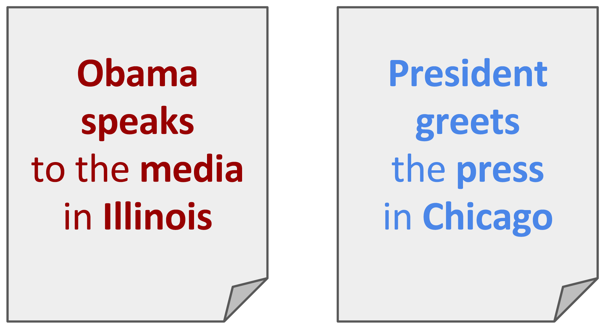

This is a project I did as a Data Science Fellow at [Insight Data Science](http://insightdatascience.com/) in the January 2017 session, in consultation with [Fast Forward Labs](http://www.fastforwardlabs.com/).

Fast Forward Labs is in the business of building prototypes by taking cutting edge machine learning and AI research and evaluating its feasibility in the real world. They were interested in building a chat bot that incorporates some pretty cool recent methods for natural language processing.

And so I built a user-friendly and reasonably **smart bot for Slack that helps users stay on topic**.

Below you can find the links to the demo Slack Team where you can play with the bot (see Section 3 for details), a presentation that closely follows this blog, and the bot code on Github.

<a href="https://slack-police.slack.com" class="btn2">Demo Slack Team</a>
<a href="https://docs.google.com/presentation/d/1VLeTp8POxU1A3GbDOCrLtfiA20Cu3ofJFv76Ezbo4Vk/pub?start=false&loop=false&delayms=3000" class="btn2">Presentation</a>
<a href="https://github.com/aficnar/slackpolice" class="btn2">Code on Github</a>

---

# Contents

[**1. Why a smart policing bot?**](#why_bot)

[**2. Getting the data**](#get_data)

[**3. Demo: Officer Slackbot in action**](#demo)

[**4. Bot brains**](#bot_brains)

[**5. How smart is the bot?**](#bot_smart)

[**6. Summary & what more can be done**](#summary)

[**7. About me**](#about_me)

---

# <a name="why_bot">1. Why a smart policing bot?</a>

[Slack](https://slack.com/) is a popular messaging app for teams that allows team members to discuss different topics, organized in channels. When a new member joins a Slack team that's been around for some time, they can sometimes tend to post messages in wrong channels. Nobody wants to be that nagging senior team member trying to direct this rookie to a more appropriate place.

Wouldn't it be nice to have a smart bot that can learn topics of different channels, monitor the discussions, and then warn users if they go off topic? Building such a bot is the aim of this project.

---

# <a name="get_data">2. Getting the data</a>

In order to build my bot and see how accurately it performed, I needed some data. Because it's private, Slack data is hard to come by, but the next best thing is [Reddit](https://www.reddit.com/); its data is easily available and has a similar structure to Slack, where instead of channels, different topics are grouped into subreddits.

For the purposes of demonstrating the model, I chose the following five topics (subreddits): *Diving*, *Handball*, *Corgi*, *Data Science*, and *Machine Learning*. These have been chosen intentionally so that some of them are more similar to each other and others are less (plus, they also tell you something about the things I like!).

The relevant data (submissions and comments) can then be downloaded using Reddit's excellent API through an easy-to-use [`PRAW`](https://praw.readthedocs.io/en/latest/#) package for Python, and stored in a SQL database. (See the code on my Github for details.)

---

# <a name="demo">3. Demo: Officer Slackbot in action</a>

To showcase my bot's might, I made a [demo Slack team](https://slack-police.slack.com) -- go ahead and try it out! I created a generic user with a **username `slack.police.demo@gmail.com`**. The password I have either shared with you when I presented the project or you can [email me](mailto:aficnar@gmail.com) to ask for it.

In the demo Slack team I created 5 channels, corresponding to the 5 subreddits above, and populated those channels with the comments obtained from the corresponding subreddits. For simplicity, I focused only on comments, rather than the submissions, since they tend to be shorter, perhaps more faithfully mimicking the form of Slack messages.

To upload the Reddit data to my Slack team, I first registered 4 [bot users](https://api.slack.com/bot-users) on Slack (posing as famous characters on Seinfeld!), and used the excellent package [`slackclient`](https://github.com/slackapi/python-slackclient) that allows one to communicate with Slack's API from Python. For more details on how to build simple bots in Python, check out my code here on Github and/or have a look at a great tutorial from the [Full Stack Python](https://www.fullstackpython.com/blog/build-first-slack-bot-python.html) blog. The bot itself is hosted on [AWS](https://aws.amazon.com/), constantly monitoring the discussions in the demo Slack team.

Below is a little illustration of the bot's basic functionality, showing me entering a couple of messages in the *Diving* channel. As you can see, as long as the messages are vaguely related to diving, or are of generic content that could belong to any of the channels (e.g. 'thank you', etc.), the bot doesn't bother me. But if I mention something more closely related to one of the other existing channels, the bot will let me know where those messages might be more appropriate.

---

# <a name="bot_brains">4. Bot brains</a>

Now that we've seen the bot in action, let's take a look at how it works.

The bot obviously needs to be able to compare two messages (more generally, documents): the user's input and one of the messages already present in a channel. A standard way to compare two documents is to use the [bag-of-words](https://en.wikipedia.org/wiki/Bag-of-words_model) (BoW) approach, which assigns a sparse vector to each document, with elements related to the number of times a given word appears in the document (this includes approaches such as [tf-idf](https://en.wikipedia.org/wiki/Tf%E2%80%93idf) as well). Once such document vectors are generated, the similarity of the two documents can be measured by calculating the cosine between the corresponding vectors: higher cosine similarity indicates more similar documents.

However, problems arise when two documents share no common words, but convey similar meaning, such as in the example on the right. The BoW / tf-idf vectors of these two documents are perpendicular, yielding zero cosine similarity.

## 4.1 Word Mover's Distance

A way to fix this was proposed recently at the *International Conference on Machine Learning* in 2015 in the form of the [Word Mover's Distance](http://jmlr.org/proceedings/papers/v37/kusnerb15.pdf) (WMD) model. This model starts by representing each of the words in a document with vectors in a high dimensional (word embedding) vector space by using [word2vec](https://papers.nips.cc/paper/5021-distributed-representations-of-words-and-phrases-and-their-compositionality.pdf) (w2v), a popular neural network model trained to reconstruct the semantic context of words. What that essentially means is that words with similar meanings will have their w2v vectors close to each other, as illustrated below. I used a pre-trained word2vec model from the [Spacy](https://spacy.io/) package, which has been trained on the Common Crawl corpus.

With this model, a natural way to estimate how dissimilar, or distant, the two documents are is to look at the distance between the corresponding word vectors and, roughly speaking, add those distances up. This metric is called the Word Mover's Distance, because it is an instance of the well-known [Earth Mover's Distance](https://en.wikipedia.org/wiki/Earth_mover's_distance) (EMD) optimization problem, only formulated in the word embedding space.

What follows is an intuitive, but somewhat technical explanation of the EMD problem, important for understanding the modification of the WMD that I implemented. <a onclick="showhide('expl1')">Click here for more details.</a>

The EMD assumes that one has two collections of vectors - let's call them the <i>senders</i> and the <i>receivers</i> - and a matrix of their pair-wise distances. In addition to this, each of the vectors has a weight, which is a real number smaller than 1, indicating how much "goods" each of the sender vectors has to send and how much of the goods each of the receiver vectors needs to receive. The sum of all the weights for the receiver vectors is normalized to 1, as it is for the sender vectors. The problem now is, given the distances (costs) between the sender-receiver pairs, to determine the most efficient way to <i>move</i> the goods from the senders to the receivers, allowing for partial sending and receiving (i.e. so that a sender can send a portion of its goods to one receiver and another portion to another receiver). This is obviously a non-trivial constrained optimization problem, and it has a known solution, which can be easily implemented in Python with the <a href="https://pypi.python.org/pypi/pyemd"><code class="highlighter-rouge">pyemd</code></a> package.   

WMD is the application of the EMD problem to the context of word embeddings, where the senders and receivers are w2v vectors of words from the first and second documents we're comparing, respectively. The weights of the vectors are chosen to be proportional to the number of times the corresponding word appears in the document. The distances between the vectors are then calculated using standard Euclidean distances in the word embedding space. In this way we can easily calculate the WMD distance between two documents using the <code class="highlighter-rouge">pyemd</code> package.

## 4.2 Modifying WMD

A practical obstacle in applying this method to my case was the fact that the EMD algorithm has a horrible time complexity: <i>O(p^3 log(p))</i>, where <i>p</i> is the number of unique words in the two documents. I would need to compare the user's input to all of the previous messages in all the channels, calculate the average distance for each of the channels, and the one with the smallest average distance would be the prediction for the channel to which the user's message should go. If the user posted the message in the channel I predicted, the bot wouldn't do anything, otherwise the bot would advise the user to consider posting it to the predicted channel. For Slack teams that contain a lot of messages spread out over a lot of channels, this would not be a feasible approach for a real time response of the bot.

So I needed to modify the WMD method somewhat. Comparing the input message to *all* the messages in a given channel seemed excessive: surely there are messages that are more "representative" of the channel content than the others, and it would be useful enough to compare the user input to those messages only. However, that would require expensive preprocessing, in which I would essentially have to sort the channel messages using WMD as a key. But could I somehow *construct* a single message representative of an entire channel?

Intuitively, this could be achieved by looking at word distributions in a given channel, as shown on the right. To a person, looking at the first, say, 10 or so words that occur most often in a channel would give a pretty good idea of what that channel is about. A single message representative of that channel should therefore contain only those 10 words. To use this message in EMD/WMD, I needed to choose the weights (see previous subsection) of the vectors representing the words in it. Since the weights in a standard WMD are directly proportional to how many times a given word appears in a message, I made the weights in my representative message proportional to the number of times a given word appeared in the entire channel (and then normalized it).

In this way I constructed a single representative message for each channel, and only needed to calculate the WMD distances between the input message and each of the representative messages to find the shortest one, and predict the corresponding channel as the one to which the input message is supposed to go.

---

# <a name="bot_smart">5. How smart is the bot?</a>

But is 10 words enough to form a representative message? Is it 30? 100? The optimal number of words can be found, <i>n_words</i>, by treating it as a hyperparameter and tuning it on a validation set. My entire corpus consisted of about 5000 comments of varying length from each of the 5 channels, which will be split into a training (70%), validation (20%) and test (10%) set.

The training set was used to infer the word distributions for each of the channels. The text was pre-processed in a standard way (by removing punctuation, stop words, etc.), and in addition to that I also used `Spacy`'s parts-of-sentence tagging to only leave the nouns, verbs and adjectives, as they are the ones carrying most of the meaning. I also removed all the words that are not in `Spacy`'s pre-trained vocabulary, since I didn't have a vector representation for those (luckily, only about 2.5% of the words are not in the vocabulary).

I used the validation set to determine the best value for <i>n_words</i>, which turned out to be 180.

Finally, I used the test set to compute the final accuracy of my model. On the right you can see the confusion matrix for the test set, showing the distributions of messages from their true categories over the predicted ones. The accuracy of this model is about 74%, which is pretty good, and a noticeable improvement from the 68% that I got from the tf-idf approach and using the cosine similarity as the metric.

## 5.1 Introducing the threshold

In the confusion matrix there is some expected confusion with the topics that are more closely related: for example, 24% of messages from the machine learning channel got misclassified as data science. But under the hood, a lot of these messages are in fact pretty generic (e.g. "thank you") and could belong to any channel. In fact, my model picked up on that: the distances to all the channels for these messages are pretty similar, and it just happens that the distance to the data science channel was the shortest one.

I could therefore eliminate some of these messages by introducing a threshold: when the distance between the channel the message was posted in and the channel that the message was classified to is smaller than some value epsilon, the prediction of the model can be ignored, and the bot won't advise the user. To keep things simple, I used a fixed, relative threshold for the entire corpus, although this could be certainly improved by, for example, considering different thresholds for different channels.

As is usually done, I treated the threshold as a hyperparameter, and tuned it on the validation set. <a onclick="showhide('expl2')">Click here for more details.</a>

However, this was slightly tricky in my case, as the messages are not labeled as generic or non-generic, and it is therefore impossible to code up some automatic verification process that could tell me how accurately the model is performing in flagging messages as generic (for a given value of the threshold): an actual human being needs to look at each example the model flagged as generic and decide if it is indeed generic. Because of this, and because of the fact that optimizing for a high precision or high recall is a matter of user preference, I opted for the following practical approach of maximizing the accuracy likelihood.   

 In order not to decrease the accuracy of the model too much, I wanted to minimize the number of correctly classified messages that were flagged as generic, as flagging a message as generic introduces a possibility that I had mis-flagged it, which would decrease the accuracy of the model. On the other hand, in order to try to increase the accuracy of the model, I wanted to maximize the number of incorrectly classified messages flagged as generic, as flagging a message as generic also introduces a possibility that I had correctly flagged it, which would increase the accuracy of the model. As the threshold increases, the amount of correctly classified messages predicted to be generic will increase, while the amount of the incorrectly classified messages predicted to be non-generic will decrease, as shown in the plot above. A natural choice for the optimal threshold is the place where the two curves intersect, which is about 0.05 in this case.

Once I chose an optimal threshold, I could apply the model to the test set, and then manually check whether all the messages the model flagged as generic are indeed generic, and use that to update the effective accuracy of the model. <b>This resulted in a final accuracy of about 84%.</b>

---

# <a name="summary">6. Summary & what more can be done</a>

In summary, I've built a user-friendly and a reasonably smart bot for Slack that helps users stay on topic.

This bot prototype can be obviously applied to platforms other than Slack, including Reddit and Stack Overflow. It could also potentially be developed into more advanced applications, including automatic email classification and perhaps even filtering out hate speech on Twitter.

This is a project I built in three weeks at Insight. That's not a lot of time, but it's been a lot of fun, and I've got a bunch of ideas I would love to implement some time in the near future:

### Better estimate of bot's performance in the real world <a onclick="showhide('extra1')">[show / hide]</a>

 To better estimate the performance of the bot in the real world, I need more data. One idea would be to download something like a 100 random subreddits and then:
<ul>
<li>Choose a sub-corpus of, say 5, random subreddits.</li>
<li>Calculate the accuracy of the model with the threshold (upper bound on the actual accuracy) and without it (lower bound). </li>
<li>Do this for several more random choices of 5 subreddits, and average.</li>
<li>Repeat the whole procedure for different sub-corpus sizes, and report the lower and upper band on the accuracy as a function of the number of channels considered. </li>
</ul>

### Starting the bot on an empty channel <a onclick="showhide('extra2')">[show / hide]</a> 

 The bot obviously works well when there's a lot of messages already present in Slack channels. But what if the Slack team is just starting and there's not that much data? Cold start is a known problem in machine learning, and my modification of the WMD approach could be useful in this context. For example, one could simply ask users to list some keywords in the description of a channel in their order of importance, and then use these keywords to form representative messages for each channel, inferring the weights based on the order of the words. Then, after enough messages have been posted (“enough” under a certain criterion), the bot could start using them for prediction.

### More features <a onclick="showhide('extra3')">[show / hide]</a> 

 In the current model, I've been simply looking at the textual content of the messages, but in the real world there are other features that could be used to help in correctly classifying the messages.
<ul>
<li>One possible feature is taking the identity of the user posting the message into consideration. Intuitively, a veteran user would not be expected to go off-topic on a channel, but a new user might, and should therefore receive more attention. That could be implemented by e.g. giving a different weight to the messages from different users, based on the amount of text they entered before. Or, one could simply introduce a higher threshold for more "trusted" users.</li>
<li>Another potentially relevant feature is the time a user posts a message. More recent messages should be more important, and this could be taken into account by e.g. weighing them with time-dependent exponentials. This would also allow for the channel topics to slowly change over time.</li>
</ul>

### Augment a pre-trained word2vec <a onclick="showhide('extra4')">[show / hide]</a>

 Word2vec representations of words used in the current version of the bot come from a pre-trained model, i.e. the linguistic context for those words is inferred from the generic common crawl texts. But the relations between the words may change for specific channels. For example, the words <i>random</i> and <i>forest</i> may seem pretty dissimilar in a general context, but in a machine learning channel, their vectors should be pretty close. It would therefore be great to try to augment the pre-trained model with the examples from the current channels, so the power of the pre-trained model and its wealth of word vectors is retained, but also teach it to recognize relations between words specific to a channel.

### Density functions in w2v space <a onclick="showhide('extra5')">[show / hide]</a>

 Grouping messages into different classes using their representation in a higher dimensional space sounds a lot like clustering. What if one could define a simple density function in the word embedding space for each channel, made up of Gaussians centered around each word's vector, with a tune-able variance? Then, when a user enters a message, one could simply calculate its value in each of the density functions, and predict based on which of the density functions has the highest value (and tune the variance on the validation set).
<ul>
<li>This would also perhaps allow for better flagging of the generic messages, as their clusters should have a similar support in all the density functions.</li>
<li>Finally, this approach could allow for detecting when a similar parallel topic arises in a channel. In this case, we would see the original cluster slowly splitting into two clusters close to each other, and when the bot notices this, it could advise the Slack team owner to consider splitting the channel into two.</li>
</ul>

### Making the bot more user friendly <a onclick="showhide('extra6')">[show / hide]</a>

 It would be great to improve the overall user experience of the bot, for example:
<ul>
<li>Maybe sometimes you don't want the bot to bother you, so it'd nice to be able to shut it down. This can be done by e.g. implementing a <a href="https://api.slack.com/slash-commands">slash command</a> on Slack. Slash commands essentially send an <code class="highlighter-rouge">HTTP POST</code> request to a URL of choice, which could be used to start and pause the bot.</li>
<li>With the same slash command one could also modify bot's parameters. For example, if the bot seems too sensitive, one could increase its threshold.</li>
<li>It would be perhaps better that, when the bot advises users, it did so privately, i.e. so that only the affected user can see it, so it doesn't create additional noise on the channel. These kinds of hidden messages are possible, but for that purpose, the bot would need to be registered as a Slack App.</li>
<li>Having the bot as a Slack app would also allow it to display buttons. When the bot suggests that the message is more appropriate for a different channel, the user could click on 'okay' and the message would get copied over to that channel. If the user wants to keep the message in the channel where it was posted, he or she could click 'no', which the bot could use for online learning (for example, for updating its thresholds).</li>
</ul>

### Other approaches <a onclick="showhide('extra7')">[show / hide]</a> 

 In this project I started with a simple bag-of-words/tf-idf approach, after which I focused on applying (and modifying) Word Mover's Distance to quantify how similar (or distant) two documents are. There are other models on the market, and it would be interesting to see the performance of some of those in this context:
<ul>
<li><a href="https://github.com/facebookresearch/fastText">FastText</a> is a recent method from Facebook AI, essentially an extension of the standard word2vec that represents words as bags of characters n-grams. It can be trained really quickly and allows for online learning.</li>
<li>The current version of the bot constructs representative messages using a simple bag-of-words approach, but it would be interesting to try and see if topic extraction via <a href="https://en.wikipedia.org/wiki/Latent_Dirichlet_allocation">LDA</a> would improve accuracy. </li>
<li>Other potentially interesting models to consider would be <a href="https://github.com/ryankiros/skip-thoughts">skip-thoughts</a>, <a href="https://radimrehurek.com/gensim/models/doc2vec.html">doc2vec</a> and perhaps even training an <a href="https://en.wikipedia.org/wiki/Long_short-term_memory">LSTM</a> neural network.</li>
</ul>

---

## <a name="about_me">7. About me</a>
My name is Andrej Ficnar, I'm a theoretical physicist and an aspiring data scientist. I got my PhD from Columbia University in 2014, where I studied applications of string theory to real-world physical systems in order to better understand their properties. After that, I moved to the University of Oxford for a postdoc, where I got more and more interested in applying my coding and analytical skills to data-rich environments. This eventually led me back to New York in 2016, and then into Insight.

Check out my profile on [Linkedin](https://www.linkedin.com/in/aficnar) and my codes on [Github](https://github.com/aficnar/) for more info about me.

