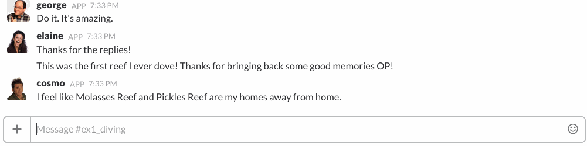
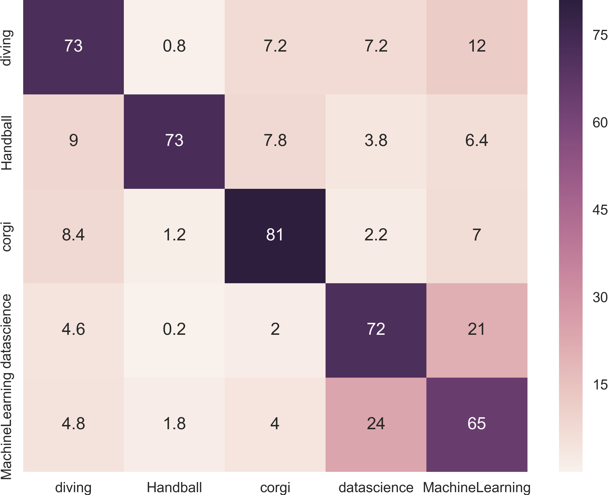
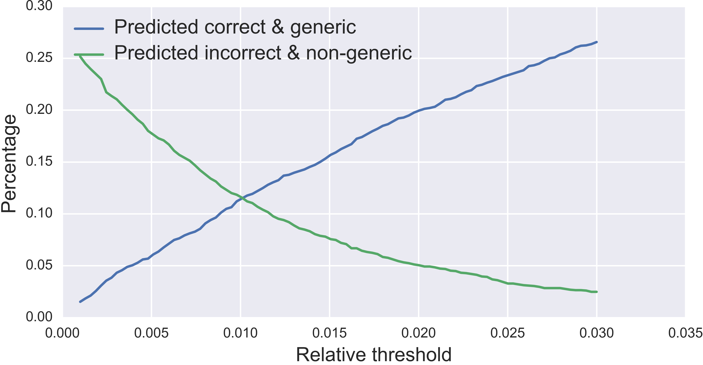

*This is a guest post featuring a project by Andrej Ficnar, now a data scientist at Schireson Consulting, completed as a fellow in the Insight Data Science program. We are partnered with Insight and occassionally advise fellows on month-long projects, from idea to implementation.*

[Slack](https://slack.com/) is a popular messaging app that brings communication together in one place. It provides messaging, archiving, and searching for teams while organizing conversations into channels. The names of channels are often not sufficiently informative to understand which topics are relevant to a given channel. Veterans just *know*, newbies struggle. This blog post introduces Slackpolice, a bot that learns the different channel's topics, monitors conversations, and warns users when they go off topic. The bot relies on an implementation of [Word Mover's Distance](http://proceedings.mlr.press/v37/kusnerb15.pdf), introduced at the leading machine learning conference [NIPS](https://nips.cc/) in 2015, and [word embeddings](https://papers.nips.cc/paper/5021-distributed-representations-of-words-and-phrases-and-their-compositionality.pdf). Give it a [try](https://slack-police.slack.com)!

# Bot Brains: Word Mover's Distance With a Twist

At its heart, the bot needs to be able to compare two messages (documents): the user's input and messages already present in a channel. A standard way to compare two documents is to use [bag-of-words](https://en.wikipedia.org/wiki/Bag-of-words_model) (BoW), which includes approaches such as [tf-idf](https://en.wikipedia.org/wiki/Tf%E2%80%93idf) and cosine similarity. However, BoW does not capture semantic properties of words, and problems arise when documents share related but not identical words (e.g. "press" and "media").

To address this, I used [Word Mover's Distance](http://jmlr.org/proceedings/papers/v37/kusnerb15.pdf), a novel-ish similarity metric built on top of (and leveraging) [word embeddings](https://papers.nips.cc/paper/5021-distributed-representations-of-words-and-phrases-and-their-compositionality.pdf). At a high level, word embeddings are high dimensional representations of words that capture their semantic properties (i.e. distributional semantics). Words of similar meaning "live" close to one another in this high dimensional space. I used pre-trained word embeddings from [Spacy](https://spacy.io/) trained on the Common Crawl corpus.

With word embeddings, a natural way to estimate how dissimilar (or *distant*) two documents are is to look at the distance between the corresponding word vectors and, roughly speaking, add up those distances. That is the main idea behind the Word Mover's Distance approach, and neatly, it is an instance of the well-known [Earth Mover's Distance](https://en.wikipedia.org/wiki/Earth_mover's_distance) (EMD) optimization problem, only formulated in the word embedding space. 

### WMD = Earth Mover's Distance for Document Similarity

The EMD assumes that one has two vectors, let's call them *senders* and the *receivers*, and a matrix of their pair-wise distances. Additionally, each of the vectors has a weight, a real number smaller than 1, indicating how many "goods" each of the sender vectors has to send and how much of the goods each of the receiver vectors needs to receive. Given this formulation, the EMD can be posed as a transportation problem: given the distances (costs) between the sender-receiver pairs, determine the most efficient way to *move* the goods from the senders to the receivers, allowing for partial sending and receiving (i.e. so that a sender can send a portion of its goods to one receiver and another portion to another receiver). This problem is a non-trivial constrained optimization problem. Luckily, it has a known solution, which can be easily implemented in Python with the [`pyemd`](https://pypi.python.org/pypi/pyemd) package.

WMD is the application of the EMD problem in the context of word embeddings where the senders and receivers are word embeddings of words from the first and second document we're comparing, respectively. The weights of the vectors are chosen to be proportional to the number of times the corresponding word appears in the document, and the distances between the vectors are calculated using standard Euclidean distances in the word embedding space. In this way we can easily calculate the WMD distance between two documents using the `pyemd` package.

### *O(p^3 log(p))*, Terrible Time Complexity

A practical obstacle in applying this method is the fact that the EMD algorithm has a terrible time complexity: *O(p^3 log(p))*, where *p* is the number of unique words in the two documents. We would need to compare the user's input to all of the previous messages in all the channels, then calculate the average distance for each of the channels, and identify the one with the smallest average distance which would be our prediction for the channel that the user's message should belong to. If the user posted the message in the predicted channel the bot doesn't do anything; if not, the bot will advise the user to consider posting it to the predicted (i.e., correct) channel. For Slack teams that contain a lot of messages spread out over many channels, this approach will not be feasible.

Surely there are messages that are more "representative" of the channel than others. Comparing the input message to *all* the messages in a given channel seems excessive. It's likely sufficient to compare the user input to those representative messages only. However, this approach would require expensive preprocessing, in which we essentially have to sort the channel messages using WMD as a key. Can we construct a single message representative of an entire channel? 

### Slack Channel "Fingerprints"

Intuitively, we could achieve this representation by looking at the word distributions in a given channel. To a human, looking at the first 10 or so of the most frequently occuring words in a channel would give a sense of what that channel is about. A single message representative of that channel should therefore contain only those 10 (or so) words! This is where word embeddings are crucial: even if the user's input belongs to a channel but does not contain any of the words from its representative message *exactly*, WMD distance will still be rather short, due to the semantic similarity between the user's word vectors and the word vectors in the representative message. 

To use the representative message in EMD / WMD, we need to choose the weights of the vectors representing the words in it. Since the weights in a standard WMD are directly proportional to how many times a given word appears in a message, we can make the weights in our representative message proportional to the number of times a given word appears in the entire channel (and then normalize it). Once we construct representative messages for each of the channels, all we need to do is calculate the WMD distances between the user's input message and each of the representative messages, find the shortest one, and predict the corresponding channel as the one the input message is supposed to go to. But, are the top 10 words enough to form a representative message? How about 30? We found the optimal number of top words by treating it as a hyperparameter and tuning it on a validation set. Turns out it was 180 (see below).

# Implementing the Bot

Now that we have the bot's brains all figured out, in order to actually build and train the bot, we need some data. 

### Data: Reddit in Place of Slack

Slack data is hard to come by since it's private. The next best thing is [Reddit](https://www.reddit.com/) given that its data is easily available and has a similar structure to Slack, where instead of channels, different topics are grouped into subreddits. To build the bot prototype, I chose the following five topics (subreddits): *Diving*, *Handball*, *Corgi*, *Data Science*, and *Machine Learning*. These have been chosen intentionally so that some of the topics are more similar to each other and others are less so (plus, they also tell you something about the things I like!). The relevant data (submissions and comments) can then be downloaded using Reddit's excellent API through an easy-to-use [`PRAW`](https://praw.readthedocs.io/en/latest/#) package for Python, and stored in a SQL database. 

To showcase the bot's abilities, I made a [demo Slack team](https://slack-police.slack.com) where I created 5 channels, corresponding to the 5 subreddits above, and populated those channels with the comments obtained from the corresponding subreddits. For simplicity, I focused only on comments rather than the submissions since they tend to be shorter, perhaps more faithfully mimicking the form of Slack messages. To upload the Reddit data to my Slack team, I registered 4 [bot users](https://api.slack.com/bot-users) on Slack (posing as famous characters on Seinfeld!), and used the excellent package [`slackclient`](https://github.com/slackapi/python-slackclient) that allows one to communicate with Slack's API from Python. For more details on how to build simple bots in Python, check out my code on Github and / or have a look at a great tutorial from the [Full Stack Python](https://www.fullstackpython.com/blog/build-first-slack-bot-python.html) blog. The bot itself is hosted on [AWS](https://aws.amazon.com/), constantly monitoring the discussions in the demo Slack team.

### Initial Model Performance

Now, I apply the bot's brains to this Reddit data. First, I tuned the optimal number of *top words* in the channels' representative messages, which turns out to be 180 (take a look at the confusion matrix). The accuracy of this model is about 74%, which is pretty good and a noticeable improvement from 68% that one gets from the tf-idf approach and using the cosine similarity as the metric. 

### Turns Out "Thank You's" Can Be Annoying 

In the confusion matrix we see some expected confusion with the closely related topics: for example, 24% of messages from the machine learning channel got misclasified as data science. If we look under the hood, we can see that a lot of these messages are in fact pretty generic (e.g. "thank you") and could belong to any channel. In fact, our model picked up on the fact that the distances to all the channels for these messages are pretty similar, and it just happens that the distance to the data science channel was the shortest one. 

To eliminate some of these "generic" messages, I introduced a threshold: when the distance between the channel the message was posted in and the channel that the message was classified into belong to is smaller than some value *epsilon*, we'll ignore the prediction of the model and the bot won't alert the user. To keep things simple we will use a fixed, relative threshold for the entire corpus, treat it as a hyperparameter, and tune it on the validation set.

However, as the messages are not labeled as generic or non-generic we cannot code up some automatic verification process that tells us how accurately the model is performing in flagging messages as generic (for a given value of the threshold). We would need an actual human being to look at the example the model flagged as generic and decide if it is indeed generic. That seems cumbersome! Is there a more practical approach?

### Maximizing the High Accuracy Likelihood

In order not to decrease the accuracy of our model too much, we would like to minimize the number of correctly classified messages that are flagged as generic. Because flagging a message as generic introduces a possibility that we mis-flagged it, this would decrease the accuracy of the model. On the other hand, in order to try to increase the accuracy of our model, we would like to maximize the number of incorrectly classified messages flagged as generic. Given that flagging a message as generic introduces a possibility that we correctly flagged it, this would increase the accuracy of the model. As we increase the threshold, the amount of correctly classified messages predicted to be generic will increase, while the amount of the incorrectly classified messages predicted to be non-generic will decrease, as shown in the plot below. 

A natural choice for the optimal relative threshold is the place where the two curves intersect, which is about 0.05 in our case. Now that we have chosen an optimal threshold, we apply our model to the test set, manually check how many of the messages our model flagged as generic are indeed generic, and use that to update the effective accuracy of the model. **This results in the final accuracy of about 84%**, a substantial improvement from the initial 74%.

# Final Words

This bot prototype is pretty versatile: it can be applied to platforms other than Slack (such as Reddit and Stack Overflow), and it can be also potentially developed into more advanced applications, including automatic email classification and, how about filtering out hate speech on Twitter? Curious? Check out this more detailed [blog post](https://aficnar.github.io/slackpolice/) and take a look at the [bot's code](https://github.com/aficnar/slack_police).